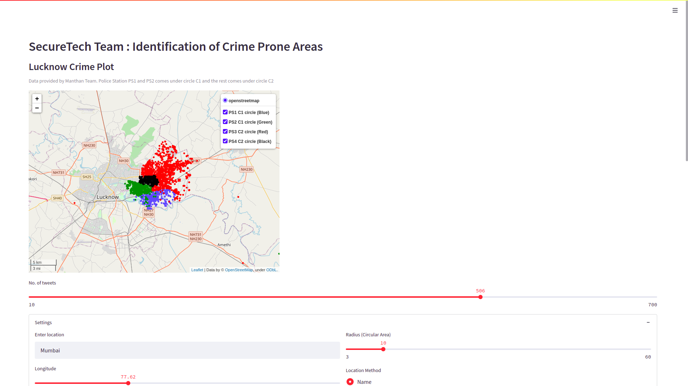
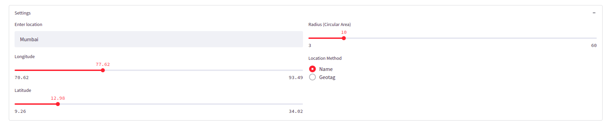
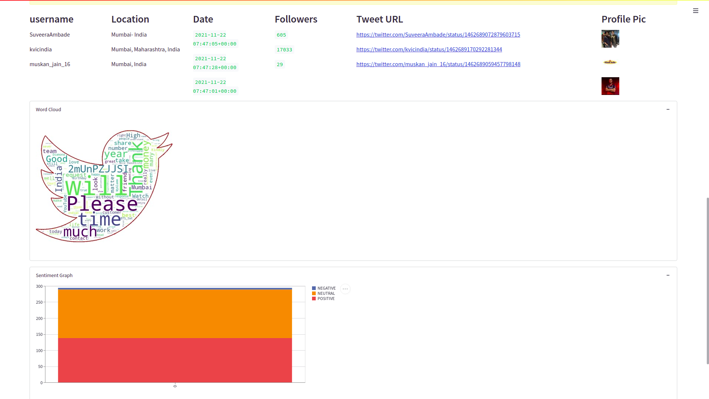

# Manthan 2021: Team SecureTech WebApp (Version 1)

### This a part of **[Manthan 2021](https://manthan.mic.gov.in/about-intellithon.php)** (Hackathon for National Security).
 

**[Link for WebApp](http://securetech.herokuapp.com/)**
 

**[Full project Description Link](https://github.com/Manukumar9319/MANTHAN_2021_SecureTech)**
 

Map of north-eastern Lucknow(provided by Manthan, with each point representing accidents or crimes (click on points for more info.).
  

### User options like:
- No. of tweets to examin
- location name
- lat, long values
- radius of the region 

  

### List of user info with negative Tweets **(Sentiment model is not 100% accurate, so please consider tweets on your own risk)**, wordcloud and stacked bar graph with no. of positive, neutral and negative tweets. 
  

### The model we used here is of TextBlob. We also created a sentiment analysis model(with accuracy 79%, LSTM layer, epoch=12, and training dataset is from kaggle(1.6M records)), but due to its size (350MB), it's not possible to deploy it on heroku.